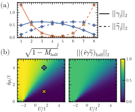
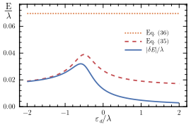

# Quantifying robustness and locality of Majorana bound states in interacting systems
This repository contains the code used to generate the data and the figures used in the paper
> **Quantifying robustness and locality of Majorana bound states in interacting systems** \
> *William Samuelson, Juan Daniel Torres Luna, Sebastian Miles, A. Mert Bozkurt, Martin Leijnse, Michael Wimmer, Viktor Svensson*

Data for Figure 2 is generated by `scripts/phase_diagram_data.jl`, and the figure itself by `scripts/phase_diagram_plot.jl`.



Figure 3 is generated by `scripts/energy_splitting.jl`.



### Methods
The main machinery of this code involves fermionic tensor products and fermionic partial traces. These are implemented in the package [FermionicHilbertSpaces.jl](https://github.com/cvsvensson/FermionicHilbertSpaces.jl).

### Reproducing this project
This code base is using the [Julia Language](https://julialang.org/) and
[DrWatson](https://juliadynamics.github.io/DrWatson.jl/stable/)
to make a reproducible scientific project.

To (locally) reproduce this project, do the following:

0. Download this code base. Notice that raw data are typically not included in the
   git-history and may need to be downloaded independently.
1. Open a Julia console and do:
   ```
   julia> using Pkg
   julia> Pkg.add("DrWatson") # install globally, for using `quickactivate`
   julia> Pkg.activate("path/to/this/project")
   julia> Pkg.instantiate()
   ```

This will install all necessary packages for you to be able to run the scripts and
everything should work out of the box, including correctly finding local paths.

You may notice that most scripts start with the commands:
```julia
using DrWatson
@quickactivate :ManybodyMajoranas
```
which auto-activate the project and enable local path handling from DrWatson.
